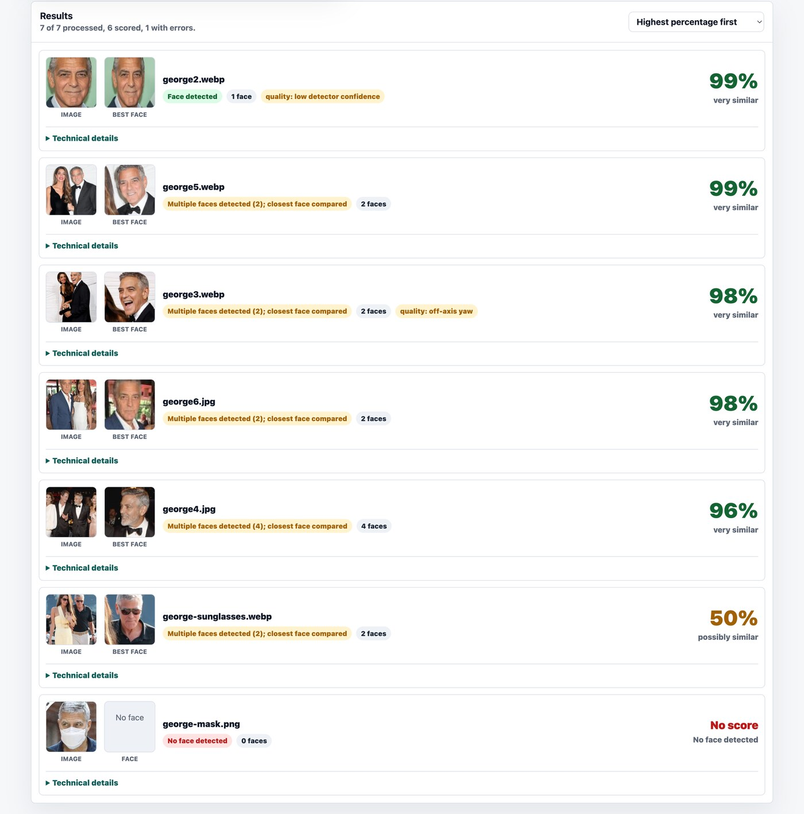

# FaceTrace Offline

<p align="center">
  <a href="docs/screenshots/facetrace-offline-marketing-card.png">
    
  </a>
</p>

FaceTrace Offline is a standalone browser app for local face similarity comparison. It runs entirely client-side from a self-contained `index.html`; there is no server, upload, telemetry, CDN, cloud API, or remote model download.

## Example Run

<p align="center">
  <a href="docs/screenshots/facetrace-offline-example-full.png">
    
  </a>
</p>

<p align="center">
  <sub>Example result list from the offline app. High percentages indicate visual similarity; occlusion can lower scores or prevent face detection. Click the image for the full screenshot.</sub>
</p>

## Run Offline

1. Open `index.html` directly in a modern browser.
2. Do not start a local server; no `localhost` connection is required or used.
3. Select one reference image, then select one or many candidate images.

The app is designed to work from a direct `file://` open. The face-api UMD bundle (which embeds TensorFlow.js v4 internally as `faceapi.tf`) and all model weights are inlined into `index.html`, so the browser does not need to load additional JavaScript, fetch model shards from the local filesystem, or contact the network.

## Source Layout

`index.html` is generated. For normal maintenance, edit these inputs instead:

- `src/index.template.html`: HTML shell with inline placeholders.
- `src/styles.css`: application styles.
- `src/canvas-readback-patch.js`: early Canvas 2D readback hint patch.
- `src/app.js`: application logic.
- `vendor/face-api.min.js`: vendored `@vladmandic/face-api` UMD bundle (face-api.js v0.22 API, modern TF.js v4 included).
- `models/embedded-models.js`: generated JavaScript that holds a gzip-compressed, base64-encoded JSON map of all model manifests and weight shards; do not edit it by hand.

The unpacked files in `models/` are kept as source/audit copies of the model assets used to generate `models/embedded-models.js`:

- `models/tiny_face_detector_model-*` (face-api detector)
- `models/face_landmark_68_model-*` (face-api landmarks)
- `models/arcface/{model.json, group1-shard1of1.bin}` (SE-MobileFaceNet ArcFace, TF.js GraphModel)

## Build

The build uses only Python 3.9+ from the standard library. No npm install, package manager, local web server, or network access is required.

```bash
python3 tools/build.py
```

This writes two generated artifacts:

- `models/embedded-models.js`, built from the unpacked model manifests and shards in `models/`. The map is gzip-compressed before base64 encoding.
- `index.html`, built from `src/`, `vendor/face-api.min.js`, and the generated model bundle.

To verify that both generated files match the source inputs:

```bash
python3 tools/build.py --check
```

The build script intentionally rejects generated HTML that reintroduces external-loading tags such as `<script src>`, `<link>`, or `<iframe>`.

## GitHub Automation

`.github/workflows/build-pages-release.yml` keeps the unusual offline build honest in CI:

- Pull requests and pushes verify `index.html` and `models/embedded-models.js` with `python3 tools/build.py --check`.
- The workflow runs JavaScript syntax checks on the maintained source and generated model bundle.
- Manual workflow runs can deploy the generated `index.html` and this README as the GitHub Pages site.
- Pushing a tag named `v*` creates a GitHub Release with `index.html` and `README.md` attached.

Pages deployment is deliberately manual so ordinary pushes do not accidentally publish an unfinished private build. To publish it, first open the GitHub repository settings and choose `Settings > Pages > Build and deployment > Source > GitHub Actions`, then run the `Build, Pages, Release` workflow manually with `deploy_pages` enabled. The workflow does not use `actions/configure-pages` automatic enablement because that requires a token other than the default `GITHUB_TOKEN`; keeping it manual avoids storing a Pages administration token in the repository.

The Pages deployment serves the same self-contained HTML artifact. The app still performs all face processing in the browser and does not require a server at runtime. The top-corner GitHub sponsor ribbon is a plain link only; it does not load external scripts, images, fonts, or tracking pixels.

## Why This Build Is Unusual

The target environment is restricted: it may allow opening one local HTML file but reject `localhost`, local servers, remote URLs, CDNs, and even sibling `file://` script/model loads because file URLs can be treated as unique security origins. A normal web build that emits separate JavaScript chunks or model files is therefore less reliable for this deployment.

For that reason, the repository keeps maintainable source files, then compiles them into one large HTML artifact. The final `index.html` is intentionally big because it includes the app, face-api with TensorFlow.js v4, and the model weights needed for offline face comparison. It is around 3.5 MB.

## Browser Compatibility

Use a recent Chrome, Edge, Firefox, or Safari with JavaScript, Canvas, Blob, File API, WebGL or CPU TensorFlow.js execution, `Response`, `atob`, and `DecompressionStream` support enabled. The app prefers WebGL for inference and falls back to a CPU backend if WebGL is unavailable. Very locked-down enterprise browsers must allow JavaScript execution in the opened local HTML file.

## Recognition Pipeline

Each candidate image goes through the same local pipeline:

1. **Detection** (`face-api.js` Tiny Face Detector): finds face bounding boxes.
2. **Landmarks** (`face-api.js` 68-point landmark net): locates eyes, nose, and mouth.
3. **5-point alignment** (closed-form 2D similarity transform): warps the face to the canonical 112×112 InsightFace template before feeding it to the recognizer.
4. **Embedding** (SE-MobileFaceNet trained with ArcFace loss, 256‑dim, ~1.3 MB int8-quantized): produces an L2-normalized face descriptor.
5. **TTA**: also embeds a horizontally flipped copy and averages the two descriptors before normalization.
6. **Quality signals**: estimates yaw and pitch ratios from the 5 points, and a Laplacian-variance sharpness score on the aligned crop. Marginal faces are flagged in the UI but never rejected.

## Similarity Percentage

Each detected face is compared with the selected reference descriptor using cosine similarity (since both descriptors are L2-normalized, this is a simple dot product). The user-facing percentage is a calibrated sigmoid:

```text
similarity = 100 / (1 + exp(-12 * (cosine - 0.32)))
```

The center 0.32 is the empirical same/different decision boundary observed for SE‑MobileFaceNet ArcFace embeddings on the MS1M training distribution; the slope 12 spreads the curve so that genuine matches saturate near 100% while impostors fall to the single-digit percent range. A small LFW pair test gives ~97-100% for same-person comparisons and ~2-7% for impostors.

Raw cosine similarity, raw Euclidean distance, detector score, yaw / pitch ratios, roll, and sharpness are all shown inside each result's technical details section.

Interpretation bands:

- `85-100%`: very similar
- `70-84%`: similar
- `50-69%`: possibly similar
- `30-49%`: low similarity
- Below `30%`: very low similarity

These thresholds are deliberately conservative and are not forensic proof.

## Privacy

All processing happens locally in your browser. No data leaves your device. The app does not upload files, call external URLs, include telemetry, or require browser permissions beyond selecting local files.

## Limitations

- Results are probabilistic and must not be used for legal, forensic, employment, access-control, or identity-verification decisions.
- All face recognition models — including SE-MobileFaceNet ArcFace — show demographic bias on cross-ethnicity and cross-age comparisons.
- Lighting, pose, blur, age differences, occlusion, image compression, and low resolution can change scores.
- The app compares visible detected faces only. If a face is not detected, no descriptor can be computed.
- If a candidate image contains multiple faces, all detected faces are scored and the closest face is used for the main result.
- If the reference image contains multiple faces, the app defaults to the largest/highest-confidence face and lets you choose a different detected reference face.

## Included Models And Library

- `index.html`: self-contained runtime application with embedded face-api UMD (vladmandic fork), embedded TensorFlow.js v4 (via face-api), and embedded model data.
- `vendor/face-api.min.js`: `@vladmandic/face-api` v1.7.x, MIT-licensed (extends face-api.js v0.22 API, includes modern TF.js v4 internally as `faceapi.tf`). License copy: `vendor/face-api.LICENSE`.
- `models/tiny_face_detector_*`: face detection model files (face-api.js weight format).
- `models/face_landmark_68_*`: 68-point landmark model files (face-api.js weight format).
- `models/arcface/*`: SE-MobileFaceNet ArcFace recognizer in TF.js GraphModel format, derived from `leondgarse/Keras_insightface` (MIT). License copy: `models/arcface/MODEL_LICENSE.txt`. Original Keras checkpoint: `se_mobilefacenet_pointwise_GDC_arc_emb256_dr0_sgd_bs512_ms1m_rand_0_bnm09_bne1e4_cos16_batch_float16_basic_model_latest.h5`.
- `models/embedded-models.js`: generated, gzip-compressed local bundle of the same model manifests and shards, also embedded into `index.html`.

Review the upstream face-api project, ArcFace weights terms, and the MS1M training dataset terms before redistributing outside your own use case.

## Troubleshooting

- **Model not loaded**: confirm you are opening the generated self-contained `index.html`, not an older copy that still referenced external local scripts.
- **Canvas readback warning**: current `index.html` applies the Canvas 2D `willReadFrequently` hint before face-api runs. If an old browser still logs this warning, it is a performance hint rather than a correctness failure.
- **Image could not be read**: try a common browser-readable format such as JPEG, PNG, WebP, AVIF, or BMP.
- **No face detected**: use a clearer image with a larger, front-facing face and fewer occlusions.
- **CPU backend used instead of WebGL**: the model still runs but inference is several times slower. Some kiosk and enterprise browsers disable WebGL by policy.
- **Slow large batches**: the app processes images sequentially and yields between files to keep the interface responsive. Very large images and large folders can still take time. WebGL typically processes a 1600px-side photo in well under a second; CPU fallback can take several seconds per image.
- **No CSV download**: confirm the browser allows downloads initiated by local pages.
